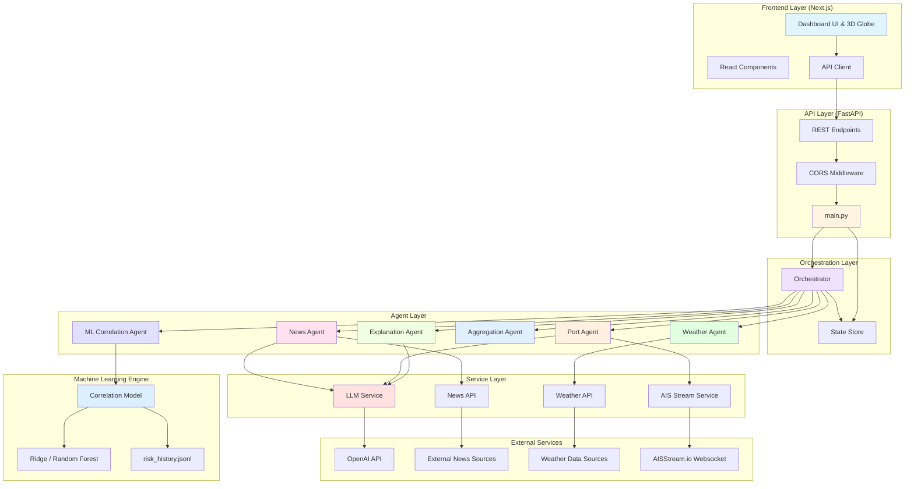
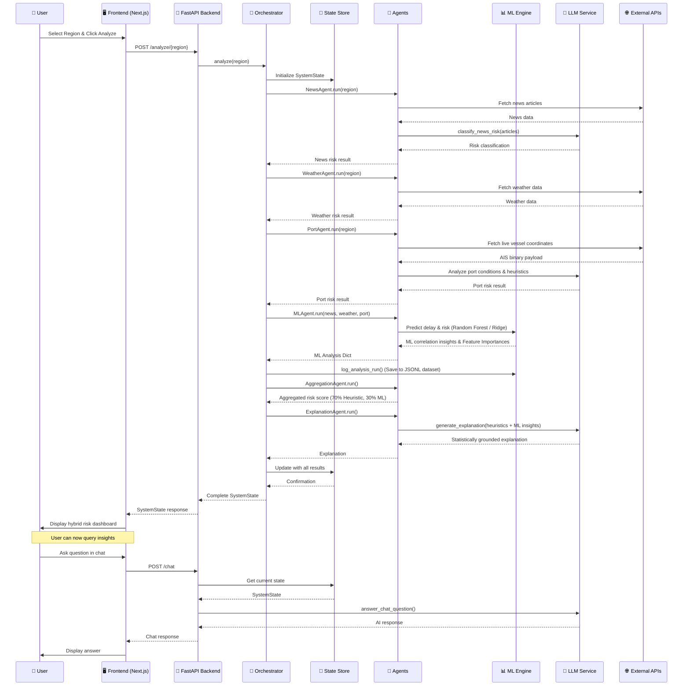
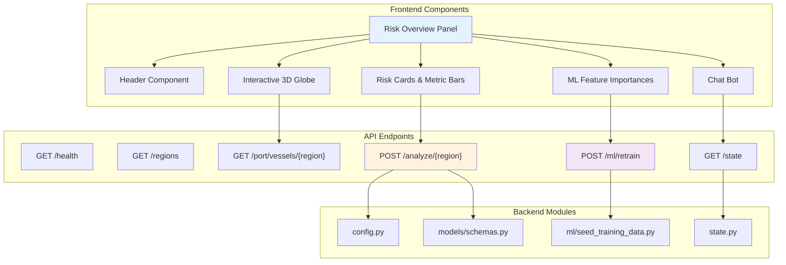
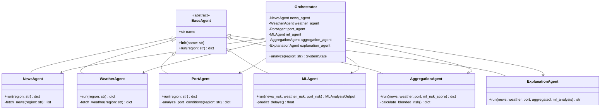
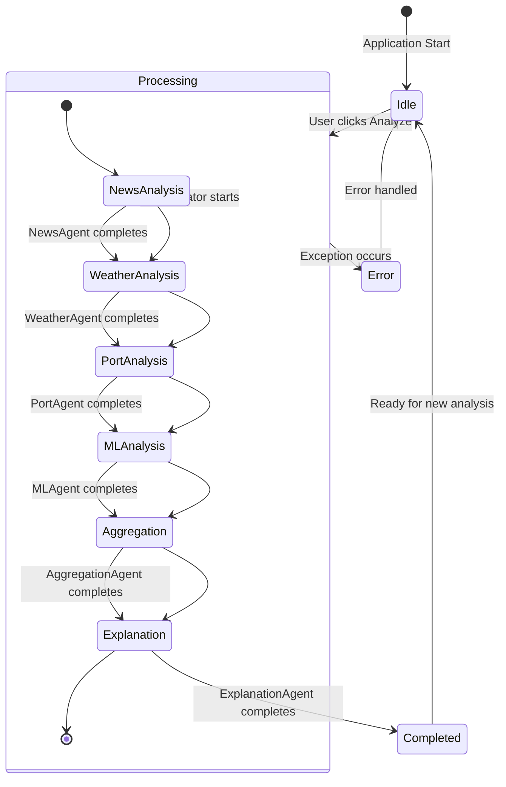

# ChainWatch Application Architecture

## High-Level Architecture



## Detailed Data Flow



## Component Architecture



## Agent Architecture



## Service Architecture

```mermaid
graph TB
    subgraph "Core Services"
        LLM[LLMService]
        ML[CorrelationModel (scikit-learn)]
        DataLog[DataLogger (risk_history.jsonl)]
    end

    subgraph "External APIs"
        NewsAPI[News API Service]
        WeatherAPI[Weather API Service]
        AISStream[AISStream Service]
    end

    subgraph "OpenAI Integration"
        Client[AsyncOpenAI Client]
        Model[GPT-4o-mini]
    end

    LLM --> Client
    Client --> Model

    NewsAgent[News Agent] --> NewsAPI
    WeatherAgent[Weather Agent] --> WeatherAPI
    PortAgent[Port Agent] --> AISStream
    MLAgent[ML Agent] --> ML
    ML --> DataLog
    
    NewsAgent --> LLM
    PortAgent --> LLM
    ExplanationAgent[Explanation Agent] --> LLM

    style LLM fill:#ffebee
    style ML fill:#e8f5e9
    style DataLog fill:#fff8e1
```

## State Management Flow



## Technology Stack

```mermaid
graph LR
    subgraph "Frontend"
        Next[Next.js 14]
        React[React 18]
        TypeScript[TypeScript]
        Tailwind[Tailwind CSS]
        Lucide[Lucide Icons]
    end

    subgraph "Backend"
        FastAPI[FastAPI]
        Python[Python 3.11+]
        Uvicorn[Uvicorn Server]
        Pydantic[Pydantic]
    end
    
    subgraph "Machine Learning Engine"
        ScikitLearn[scikit-learn]
        Pandas[pandas]
        Numpy[numpy]
    end

    subgraph "External Services"
        OpenAI_API[OpenAI API (GPT-4o-mini)]
        News[News API]
        Weather[OpenWeather API]
        AIS[AISStream.io]
    end

    Next --> React
    React --> TypeScript
    TypeScript --> Tailwind
    Tailwind --> Lucide

    FastAPI --> Python
    Python --> Uvicorn
    Uvicorn --> Pydantic

    FastAPI --> ScikitLearn
    ScikitLearn --> Pandas
    Pandas --> Numpy

    Python --> OpenAI_API
    Python --> News
    Python --> Weather
    Python --> AIS

    style Next fill:#0070f3
    style FastAPI fill:#009688
    style ScikitLearn fill:#f39c12
```

## Key Architecture Patterns

1. **Hybrid AI Architecture**: Combines deterministic rules with scikit-learn Machine Learning heuristics and LLM generative reporting.
2. **Orchestrator Pattern**: Central coordinator manages multiple specialized agents executed sequentially.
3. **ML Interception Pattern**: ML module intercepts agent telemetry dynamically before passing to standard aggregation workflows.
4. **Service Layer Abstraction**: External APIs (OpenWeather, News, AIS Websockets) are completely isolated from Agent logic.
5. **Cold-Start Bootstrapping**: Python scripts artificially seed highly correlated synthetic ground-truth data to bootstrap early Random Forest training.
6. **Data Tape Pipeline**: Real-time analysis streams continually write to JSON Lines formatting (`risk_history.jsonl`) for perpetual auto-training logic.
